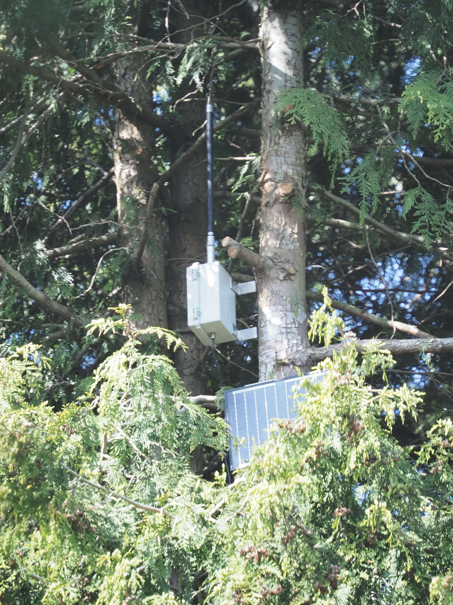
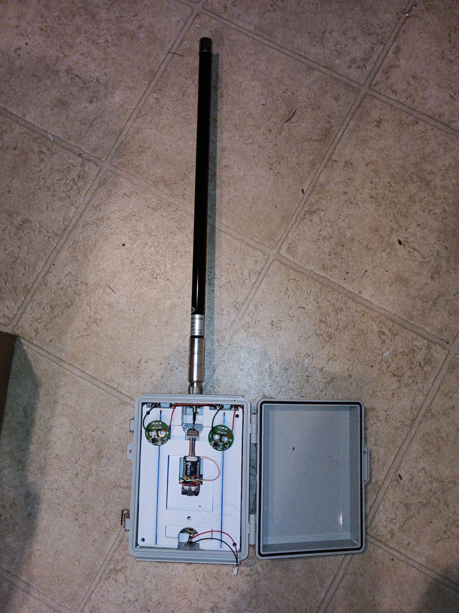
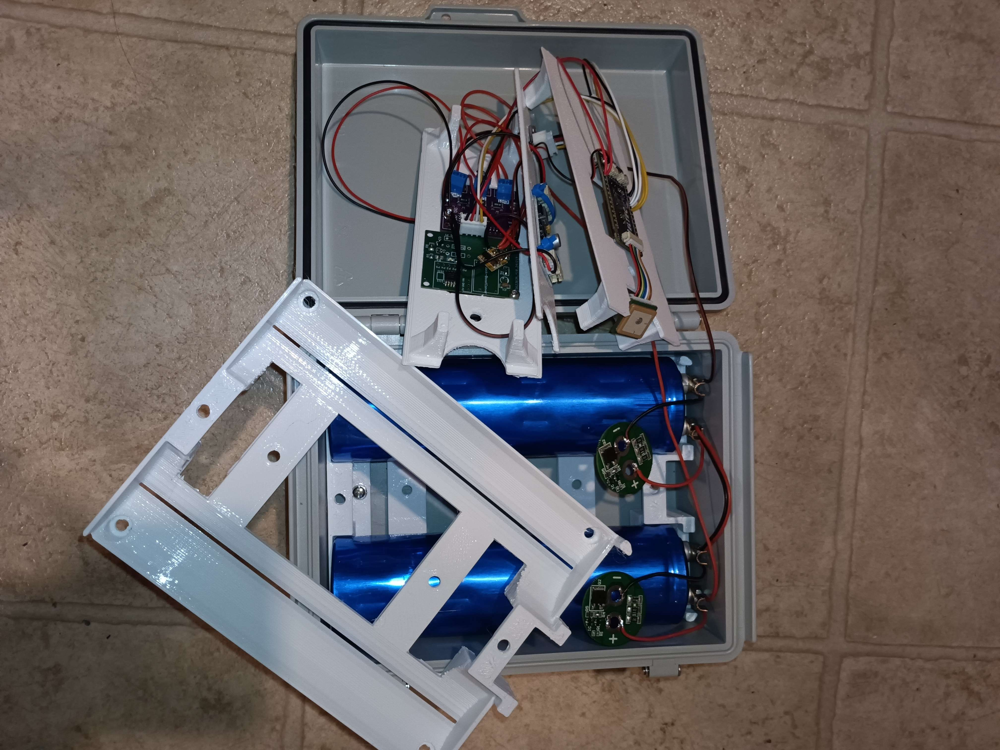
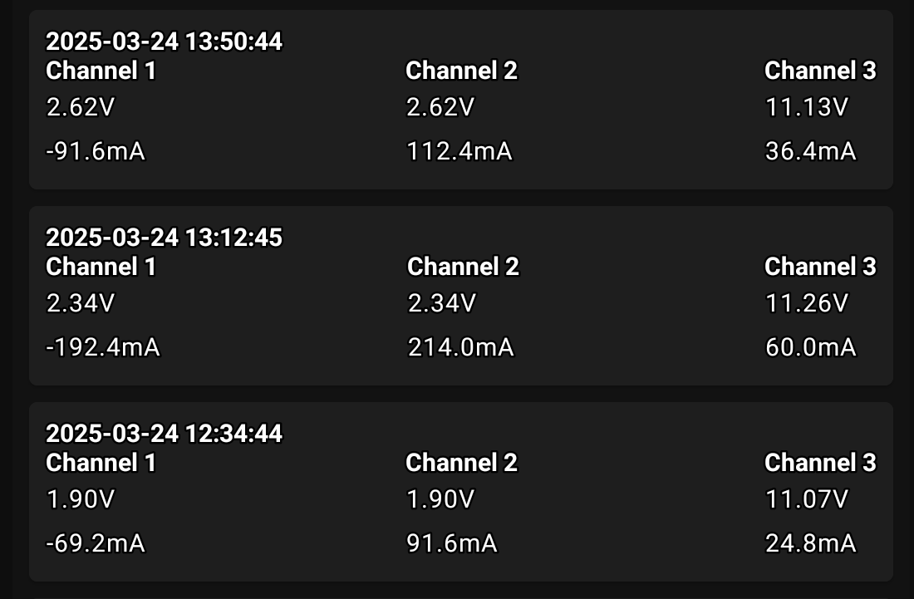
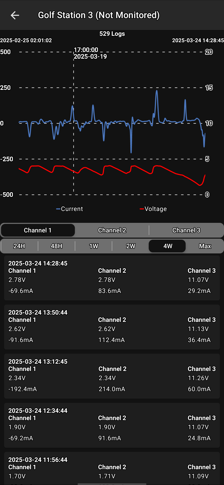
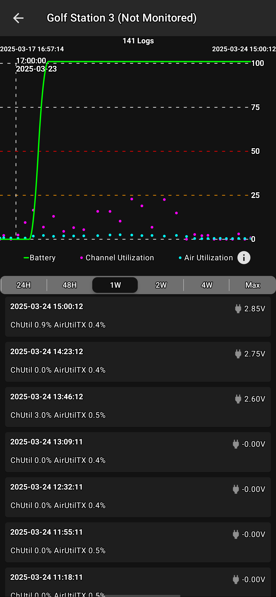

# SupercapacitorSolarNode

Here is a quick write-up on my attempt at a solar powered supercapacitor node. Currently one lives in a tree above my house and the other at ground level that I use for testing purposes (firmware, rewiring, etc).

## Quick Specs

- 5V 1150F (2x 2.5V 2300F) = ~700mAh @ 3.3v boost

- Heltec T114

- Gps, bme280, ina3221

- Attiny85 cutoff at 1v and resume at 2.5v

- 12v MPPT (CN3791)

- 10w renogy

- 7dbi antenna

## Hardware

Any supercapacitors will work as long as the rated voltage totals over 4.2v. Preferably 5v or higher since the closer you charge a supercapacitor to it's rated voltage, the faster it will self-discharge (meaning it wastes power for no reason).
- [2.5V 2300F supercapacitors](https://vi.aliexpress.com/item/1005008157585442.html)

Supercapacitor balancing boards are required since charging and discharging frequently can cause one of the 2 to become higher voltage than the other and potentially exceed the max voltage rating... Meaning it will release the magic smoke.
I used these ones that balance for 2.5v. They require full assembly on a hotplate.
- [Balance boards DIY kit](https://vi.aliexpress.com/item/1005007409357117.html)

I am using this custom cutoff and delayed resume board to manage the system when voltage drops too low to be of use. It also supplies the 3.3v output to the MCU. The cutoff is set to 1.0v and resume at 2.5v. The boost converter keeps the voltage at 3.3v when the supercaps drop below 3.3v.
- [ATTiny85-Power-Controller](https://github.com/hawkeyes0v0/ATTiny85-Power-Controller)

The board I used is a Heltec T114 (no display version) with the stock GPS module. This is not as efficient as using a RAK, but I wanted to use GPS for mesh time. T114 stock GPS is extremely power efficient if only polled a few times a day max.
- [Heltec T114 (no display) + GPS](https://vi.aliexpress.com/item/1005007916299029.html)

The solar Panel and CN3791 MPPT charger provide enough power to charge even on cloudy days. Very rarely, on extremely cloudy/dark days it won't be enough, but the supercaps have about 2 days worth of reserve power to keep it going.
The solar panel is a 10W Renogy I got from Amazon. The MPPT charger is the 12v version with a 2A max output.
- [10W Renogy Solar Panel](https://www.amazon.ca/dp/B084MGS7KC)

- [12v MPPT to 4.2v lithium charger](https://vi.aliexpress.com/item/1005001572351643.html)

Other miscellaneous parts:

- [BME280](https://vi.aliexpress.com/item/1005007348035264.html)
- [INA3221](https://vi.aliexpress.com/item/1005006160604929.html)
- [45cm Gizont antenna](https://vi.aliexpress.com/item/1005006428104797.html)
- [210x160x100mm waterproof enclosure](https://vi.aliexpress.com/item/1005005859929902.html)
- [OUTER sealed N to ipex](https://vi.aliexpress.com/item/1005002684928124.html)
- [45cm Gizont antenna](https://vi.aliexpress.com/item/1005006428104797.html)
- [M16x1.5 Stainless Steel Gland](https://vi.aliexpress.com/item/1005005076468790.html)

## Supercapacitor Info

The capacitors used are 2x 2.5V @ 2300F supercapacitors. They have been arranged in 2 sets in series with 2.5v balancing boards attached to each one. This comes to a bank of 5V @ 1150F. If ALL energy could be pulled from the capacitors, they can provide 2.66Wh of power or that of a 3.7V 700mAh Li-ion battery.

Link to datasheet: https://www.chemi-con.co.jp/e/catalog/pdf/dl-e/dl-sepa-e/dl-dle-e-170401.pdf

One thing to note, the balance boards in this node have never actually been triggered after months of testing. So you could get away with not adding them as long as you only charge to ~4.2V with a supercap rating of 2x 2.5v => 5v or more. 
Supercaps 'leak' current faster and faster, the closer you get to full charge. So they essentially balance themselves if you charge them slowly.
As an example, these supercaps have a max rating of 2.5v. When I charge them to 2.5v, they quickly drop to about 2v on their own with no load over a few hours.

The equations I used to calculate the capacitance and subsequently the available watt hours:

(C1*C2) / (C1+C2) = Ctotal
2.5V 2300F + 2.5V 2300F
(2300*2300) / (2300+2300) = 1150F @ 5V

Using 4.2V to 1.0V of available potential
((C * (Vmax^2)) / 2) - ((C * (Vmin^2)) / 2) = Joules Total
((1150 * (4.2^2)) / 2) - ((1150 * (1.0^2)) / 2) = 9568 J

Joules / 3600 seconds = Watt hours
9568 / 3600 = 2.66 Wh (theoretical maximum available power)

Watt hours / output voltage of DCDC converter = available Ah
2.66 / 3.3 = 0.805 Ah

At 3.3V output, 800mAh can be expected while ignoring self discharge and boost-buck converter inefficiencies.

## 3D Printed Parts

The STL files are included below, but you may have to modify them to support your own components or enclosure.
- [bottom 5V1150F Solar Node](https://www.tinkercad.com/things/4mrYyDIKIQc-bottom-5v1150f-solar-node)

- [top 5V1150F Solar Node](https://www.tinkercad.com/things/6spdvdrJQ3b-top-5v1150f-solar-node)

- [flat Core 5V1150F Solar Node](https://www.tinkercad.com/things/jdPOMBwyFCB-flat-core-5v1150f-solar-node)

## Tests and Results

After a few months of testing, the node has only run out of power twice during extremely dark and stormy weeks. Full charge is acheived in under an hour of full sun. 

MPPT charger can be seen converting the much higher voltage down to the supercap voltage and increasing the current significantly.

One thing I have noticed is that the MPPT charger is quite noisy... it hurts RX consistency when charging. Something I will have to look at in the future. Maybe more filtering caps on the MPPT output?

Also, Meshtastic does not support battery voltage below 2.5v, so if the capacitor voltage drops below that, it assumes the node is USB powered... Not a big deal since it rarely drops that low, but still a little annoying.

